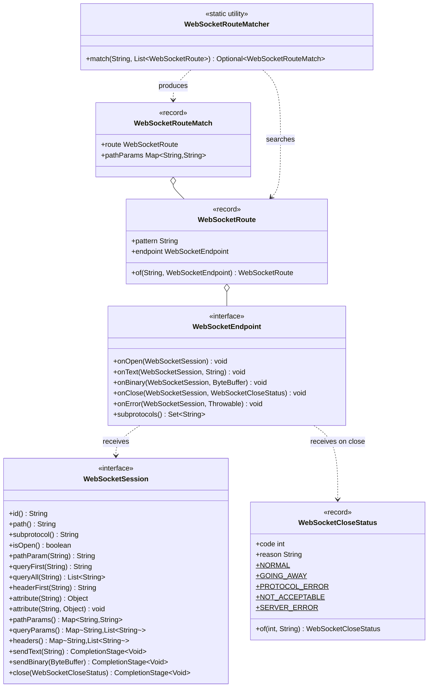
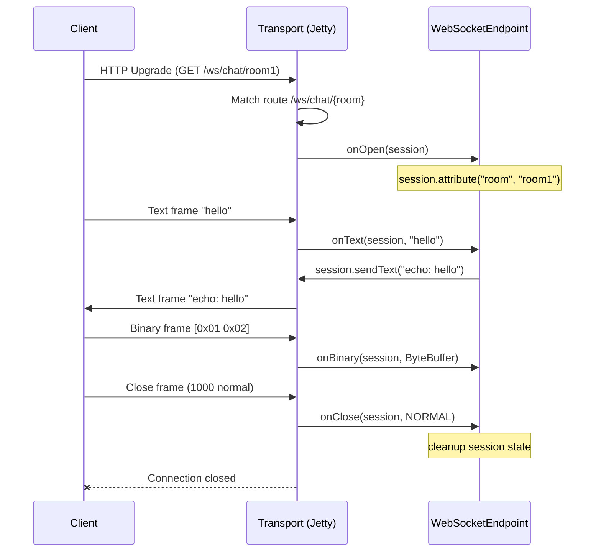

# ether-websocket-core

Transport-agnostic WebSocket contracts for the ether ecosystem. Defines the full WebSocket programming model — endpoint lifecycle, session abstraction, route matching, and close status — without coupling to any particular server (Jetty, Netty, Undertow, etc.). Transport adapters such as `ether-websocket-jetty12` implement these interfaces.

## Coordinates

```xml
<dependency>
    <groupId>dev.rafex.ether.websocket</groupId>
    <artifactId>ether-websocket-core</artifactId>
    <version>8.0.0-SNAPSHOT</version>
</dependency>
```

---

## Package overview

All public types live in `dev.rafex.ether.websocket.core`.

| Type | Kind | Role |
|---|---|---|
| `WebSocketEndpoint` | Interface | Lifecycle callbacks (open, text, binary, close, error) |
| `WebSocketSession` | Interface | Per-connection state and send operations |
| `WebSocketRoute` | Record | Path pattern + endpoint binding |
| `WebSocketRouteMatch` | Record | Matched route + extracted path parameters |
| `WebSocketRouteMatcher` | Static utility | Matches a concrete path against a list of routes |
| `WebSocketPatterns` | Static utility | Low-level pattern matching with `{param}` variables |
| `WebSocketCloseStatus` | Record | Standard close codes with predefined constants |

---

## Architecture overview



---

## WebSocket lifecycle sequence



---

## WebSocketEndpoint

All lifecycle methods have default no-op implementations so you only override what you need.

### Example: simple echo endpoint

```java
package com.example.ws;

import dev.rafex.ether.websocket.core.*;
import java.util.logging.Logger;

public final class EchoEndpoint implements WebSocketEndpoint {

    private static final Logger LOG = Logger.getLogger(EchoEndpoint.class.getName());

    @Override
    public void onOpen(WebSocketSession session) {
        LOG.info("Client connected: id=%s path=%s".formatted(session.id(), session.path()));
    }

    @Override
    public void onText(WebSocketSession session, String message) throws Exception {
        // Echo the message back to the sender
        session.sendText("echo: " + message)
               .whenComplete((v, ex) -> {
                   if (ex != null) {
                       LOG.warning("Send failed: " + ex.getMessage());
                   }
               });
    }

    @Override
    public void onClose(WebSocketSession session, WebSocketCloseStatus closeStatus) {
        LOG.info("Client disconnected: code=%d reason=%s"
            .formatted(closeStatus.code(), closeStatus.reason()));
    }

    @Override
    public void onError(WebSocketSession session, Throwable error) {
        LOG.severe("WebSocket error on session %s: %s"
            .formatted(session.id(), error.getMessage()));
    }
}
```

---

## WebSocketSession

`WebSocketSession` provides everything you need to interact with the connected client:

- `id()` — opaque unique session identifier
- `path()` — the HTTP path used for the upgrade (e.g. `/ws/chat/room1`)
- `pathParam(name)` — extract a `{param}` variable from the path
- `queryFirst(name)` / `queryAll(name)` — read query parameters
- `headerFirst(name)` — read an HTTP header from the upgrade request
- `attribute(name)` / `attribute(name, value)` — per-session state bag (thread-safe in the Jetty implementation)
- `sendText(text)` / `sendBinary(data)` — async send returning `CompletionStage<Void>`
- `close(status)` — graceful close

### Example: chat room endpoint using session attributes

```java
package com.example.ws;

import dev.rafex.ether.websocket.core.*;
import java.util.Map;
import java.util.Set;
import java.util.concurrent.ConcurrentHashMap;
import java.util.logging.Logger;

public final class ChatRoomEndpoint implements WebSocketEndpoint {

    private static final Logger LOG = Logger.getLogger(ChatRoomEndpoint.class.getName());

    // room name -> set of sessions in that room
    private final Map<String, Set<WebSocketSession>> rooms = new ConcurrentHashMap<>();

    @Override
    public void onOpen(WebSocketSession session) {
        // Path is /ws/chat/{room}
        var room = session.pathParam("room");
        if (room == null || room.isBlank()) {
            session.close(WebSocketCloseStatus.NOT_ACCEPTABLE);
            return;
        }

        // Store the room name on the session so onText can retrieve it
        session.attribute("room", room);

        // Register the session in the room
        rooms.computeIfAbsent(room, k -> ConcurrentHashMap.newKeySet()).add(session);

        LOG.info("Session %s joined room '%s' (now %d members)"
            .formatted(session.id(), room, rooms.get(room).size()));

        broadcast(room, "* user joined", session);
    }

    @Override
    public void onText(WebSocketSession session, String message) {
        var room = (String) session.attribute("room");
        if (room != null) {
            broadcast(room, message, session);
        }
    }

    @Override
    public void onClose(WebSocketSession session, WebSocketCloseStatus closeStatus) {
        var room = (String) session.attribute("room");
        if (room != null) {
            var members = rooms.get(room);
            if (members != null) {
                members.remove(session);
                if (members.isEmpty()) {
                    rooms.remove(room);
                } else {
                    broadcast(room, "* user left", session);
                }
            }
        }
    }

    @Override
    public void onError(WebSocketSession session, Throwable error) {
        LOG.warning("Error in session %s: %s".formatted(session.id(), error.getMessage()));
    }

    private void broadcast(String room, String message, WebSocketSession sender) {
        var members = rooms.getOrDefault(room, Set.of());
        for (var member : members) {
            if (member.isOpen() && !member.id().equals(sender.id())) {
                member.sendText(message);
            }
        }
    }
}
```

---

## WebSocketRoute and path variables

`WebSocketRoute` is a record binding a URL pattern to a `WebSocketEndpoint`. Patterns use `{param}` style placeholders.

```java
// Static path — no variables
var echoRoute = WebSocketRoute.of("/ws/echo", new EchoEndpoint());

// Dynamic path — {room} is a path variable
var chatRoute = WebSocketRoute.of("/ws/chat/{room}", new ChatRoomEndpoint());

// Wildcard — matches everything
var wildcardRoute = WebSocketRoute.of("/**", new FallbackEndpoint());
```

`WebSocketRouteMatcher.match(path, routes)` returns an `Optional<WebSocketRouteMatch>`. The match record holds both the matched route and the extracted `pathParams` map.

```java
var routes = List.of(
    WebSocketRoute.of("/ws/echo", new EchoEndpoint()),
    WebSocketRoute.of("/ws/chat/{room}", new ChatRoomEndpoint())
);

var match = WebSocketRouteMatcher.match("/ws/chat/lobby", routes);
match.ifPresent(m -> {
    // m.route().endpoint() => ChatRoomEndpoint
    // m.pathParams()       => {"room": "lobby"}
    System.out.println(m.pathParams().get("room")); // "lobby"
});
```

### How pattern matching works

`WebSocketPatterns.match(pattern, path)` splits both strings on `/` and checks them segment by segment:

- A segment wrapped in `{` `}` matches any value and captures it by name.
- The special pattern `/**` matches any path and returns an empty param map.
- All other segments must match exactly.

```java
// Exact match
WebSocketPatterns.match("/ws/echo", "/ws/echo");
// => Optional.of({})

// Path variable extraction
WebSocketPatterns.match("/ws/chat/{room}", "/ws/chat/lobby");
// => Optional.of({"room": "lobby"})

// Multiple variables
WebSocketPatterns.match("/api/{version}/users/{id}", "/api/v2/users/42");
// => Optional.of({"version": "v2", "id": "42"})

// No match — segment count differs
WebSocketPatterns.match("/ws/echo", "/ws/echo/extra");
// => Optional.empty()
```

---

## Handling binary messages

```java
package com.example.ws;

import dev.rafex.ether.websocket.core.*;
import java.nio.ByteBuffer;
import java.util.logging.Logger;

public final class BinaryEchoEndpoint implements WebSocketEndpoint {

    private static final Logger LOG = Logger.getLogger(BinaryEchoEndpoint.class.getName());

    @Override
    public void onBinary(WebSocketSession session, ByteBuffer message) throws Exception {
        // Echo the binary payload back unchanged
        if (message != null && message.hasRemaining()) {
            // Make a copy — the buffer may be recycled after this method returns
            var copy = ByteBuffer.allocate(message.remaining());
            copy.put(message.slice());
            copy.flip();

            session.sendBinary(copy)
                   .whenComplete((v, ex) -> {
                       if (ex != null) {
                           LOG.warning("Binary send failed: " + ex.getMessage());
                       }
                   });
        }
    }

    @Override
    public void onOpen(WebSocketSession session) {
        LOG.info("Binary echo session open: " + session.id());
    }
}
```

---

## WebSocketCloseStatus

Standard close codes are provided as constants. You can also create custom statuses with `WebSocketCloseStatus.of(code, reason)`.

| Constant | Code | Meaning |
|---|---|---|
| `NORMAL` | 1000 | Normal closure |
| `GOING_AWAY` | 1001 | Server shutting down or client navigating away |
| `PROTOCOL_ERROR` | 1002 | Protocol violation |
| `NOT_ACCEPTABLE` | 1003 | Received data type cannot be accepted |
| `SERVER_ERROR` | 1011 | Unexpected internal server error |

```java
// Close the connection normally
session.close(WebSocketCloseStatus.NORMAL);

// Close because of a server error
session.close(WebSocketCloseStatus.SERVER_ERROR);

// Custom application-level close code
session.close(WebSocketCloseStatus.of(4001, "authentication_required"));
```

---

## Subprotocol negotiation

Return the set of subprotocols your endpoint supports from `subprotocols()`. The transport layer performs RFC 6455 negotiation and calls `session.subprotocol()` to retrieve the negotiated value.

```java
public final class JsonProtocolEndpoint implements WebSocketEndpoint {

    @Override
    public Set<String> subprotocols() {
        return Set.of("v1.json", "v2.json");
    }

    @Override
    public void onOpen(WebSocketSession session) {
        // Know which subprotocol was negotiated
        var protocol = session.subprotocol();
        // => "v1.json" or "v2.json" (whichever the client offered first)
    }
}
```

---

## License

MIT License — Copyright (c) 2025–2026 Raúl Eduardo González Argote
